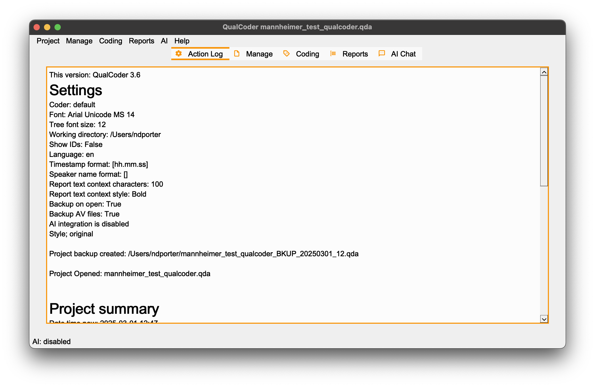

::: questions

-   How can documents and projects be imported into QualCoder?
-   What are the advantages of importing a QDPX project over only importing documents?
-   What are the key sections of the QualCoder interface?

:::

::: objectives

-   Create a QualCoder project by importing a QDPX project
-   Practice importing and organizing documents
-   Apply consistent naming conventions to project documents

:::

Once we have a general sense of the data we'll be using and what format it needs to be in, the next step is generally to create a project in a qualitative software package and import the de-identified raw data.

[QualCoder][qualcoder_homepage] is an open-source and cross-platform tool for coding and analysis of textual data. It is capable of working with a variety of data formats and has tools for both qualitative and mixed methods analysis.

::: spoiler

### Qualitative software

Qualitative software is sometimes called **CAQDAS**, an acronym for *Coding and Qualitative Data Analysis Software* to recognize the two essential functions of qualitative research software:

1. Apply codes or tags systematically to a collection of data sources
2. Analyze codes (and sometimes raw data or secondary sources) to draw conclusions

CAQDAS have various features that may be useful for particular types of data or methodologies. This lesson includes an [alternative software options page](../learners/alternative-software-options.html) for those interested in learning about other CAQDAS.

:::

## Starting QualCoder

If you haven't already installed QualCoder, please follow the instructions in [Summary and Setup][../index.html] before proceeding.

When you first open QualCoder, it will display the `Action Log` tab with some information about project settings and any currently-open projects, like the example below.

{alt="Image of the Action Log tab of QualCoder immediately after the program is launched"}

## Creating a project

Work in QualCoder is organized in projects, each of which contain their own sets of *files*, *codes* and other information. Click `Project - Create New Project` and, after choosing a location where you can easily find it later (like your `Desktop`) give the project a clear name like `Social_media_privacy_project_planning`. This creates a new folder whose name ends in `.qda` so QualCoder can identify it easily as a project.

Clicking `Save` returns us to the action log, which now displays a summary of the new project.

## Importing and navigating documents

Documents can be imported one at a time with the `Manage - Manage Files` command. Add the `BSR_Interview_Guide` and `BSR01_Transcript` by clicking on the `Page` icon with a `+` or pressing `CTRL+2` (Windows) or `CMD+2` (Mac). You can select multiple files by holding `CTRL` or `CMD` while clicking file names before clicking `Open` once you have chosen your files.

Once the documents are imported, view the interview guide by double-clicking its name.

::: spoiler

## PDFs in QualCoder

QualCoder converts all text and PDF documents to plain text when importing, which removes formatting and visual elements. The [QualCoder](https://github.com/ccbogel/QualCoder/wiki/3.2.-Files) Wiki provides guidance on how to pre-convert PDFs to a text format if you experience readability problems.

:::

Semi-structured interview guides often include both main questions like **Did you publish any of the data from your example?** and planned follow-up probes meant for when the participant doesn't volunteer as much information as the interviewer is seeking. For the question above, there are three probes to learn more about data publication (about 1/2 of the way down the document):

1. Is the data published in a repository? Which one?
2. What are your plans for storing, retaining, and deleting data in the future?
3. Who has access to the data?

When finished, use `Cancel` (or `ESC`) to return to the file manager view.

::: challenge

### Adding documents and attributes

1. On your own, find and add each of the `Big Social Research` interview transcripts from the Mannheimer project. Make sure to use short, clear, consistently structured names to make it easy to navigate between documents. Also add the BSR Interview Guide as a reference, though we won't add highlights because it only contains the questions.
2. *(optional)* You can add attributes to files in your project, used to filter files or analyze coding. Use the `Add attribute` button to create an attribute for `Type` and click in the new field of the table to label each file as `BSR` (Big Social Research transcript) or `DOC` (supporting document). Try to filter the view to only show transcripts, then remove the filter so all files are visible again.

::: hint

This project already uses a sequence of numbers to distinguish respondents without using names. One simple naming convention is `BSR_##`, where number is the respondent number (i.e. `BSR_01`). Some interview numbers may be missing; the readme file states why: "Two participants declined to have their data shared."

:::

::: hint

Filtering and unfiltering rows can be performed from the right-click context menu on a selected column.

:::

:::

Documents can also be created and edited in QualCoder, but it's interface is not optimized for significant edits. In general, any changes, including the removal of [personally identifiable information](https://en.wikipedia.org/wiki/Personal_data) from data that will be shared, should take place before they are added to the project.

::: keypoints

- QualCoder's interface has sections for managing various aspects of projects and uses a mix of icons, menus, and pop-up windows to perform actions
- Documents should be cleaned and anonymized, if needed, before adding to a project
- Consistent document naming conventions make projects easier to navigate

:::

[qualcoder_homepage]: https://qualcoder.wordpress.com/
