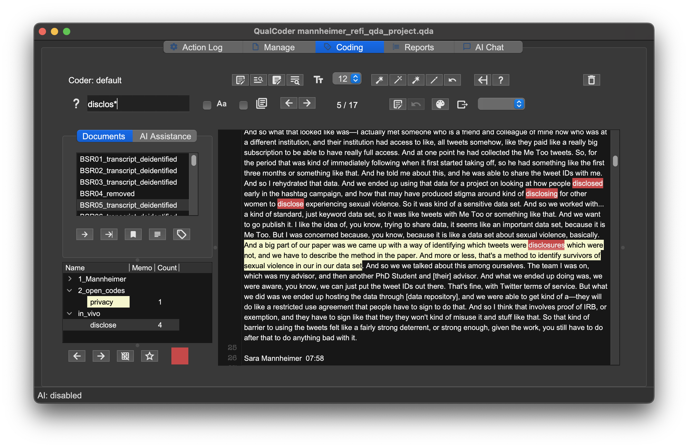

::: questions
-   What is the difference between inductive and deductive coding?
-   How can I set up and apply a flexible code tree in QualCoder?
-   How can I code text and view coded text in QualCoder?
:::

::: objectives
-   Distinguish between inductive and deductive approaches to coding
-   Develop deductive codes relevant to project objectives
-   Create and view highlights in Taguette
:::

## Getting Started with Coding: Why We Code Qualitative Data
Many qualitative researchers spend much of their analytic effort on coding data, i.e. assigning labels to excerpts in the data. That is also what we will focus on today. But before doing so, it is still worthwhile to focus on _why_ we code in the first place. Coding is a form of abstraction: we make sense of large (sometimes overwhelming) amounts of qualitative data -- somtimes referred to as "unstructured data" and generate some structure by coding it. This abstraction is not cost free: by 'forcing' codes onto your data, you may loose some of its nuance and specificity. Some qualitative traditions will therefore encourage you to only start coding once you are deeply familiar with your data. Most traditions encourage an ongoing back-and-forth between data and code to make sure data and codes match.

Moreover, the role of codes varies strongly between qualitative research traditions. In some traditions, codes are principally a background tool, used to _organize_ materials for later writing. That is the case, for example, for most ethnographic writing, as well as for many historically oriented approaches such as comparative historical analysis (as used in sociology and political science) or process tracing (as used in political science and administrative sciences). You will rarely find a mention of codes, coding schemas, or a codebook in published work using these methods, and not all of its practicioners may even code data at all. In other approaches, such as thematic analysis or discourse analysis, codes are a key _analytic_ outcome. Here, codes don't just organize the data but are used a tool to give it meaning. In publications using these methods, the codes and their development are typically made explicit and often form the core of the methods section. The tools we provide in this workshop can help you with either type of analysis, but as you develop your codeing schema, you want to be clear where you situtate yourself methodologically. 

Beginning qualitative researchers often want to jump right into analyzing data once documents are added to a project, but taking the time to develop a coding protocol first can save time and  improve the transparency and quality of research.

The first step is typically to choose a coding philosophy, that is, to decide *how* and *why* code labels will be chosen and applied. Coding philosophies range along a spectrum from **inductive** to **deductive** approaches.

## Deductive and Inductive Reasoning

Deductive reasoning begins from assumptions and hypotheses. It seeks to determine, using logic or data, whether the hypotheses can be shown to be false (or true).

Experimental methods in many disciples follow this pattern. First, a hypothesis or prediction about the effect of some cause is developed based on past research and observation. An experiment is conducted to isolate that specific potential cause, and conclusions are drawn based on the presence (or lack) of difference made by the difference.

A medicine trial is a classic example of a deductive approach. Scientists predict a treatment will help people in a specific way (for example, by reducing the length of an infection). They recruit participants (patients with the infection) who are randomly assigned so that some receive the medicine and others receive a placebo with no medicine. If the length of the infection is statistically shorter in the patients who received the medicine, that is taken as evidence that the medicine likely produced the desired result.

Deductive reasoning relies on minimizing exposure to outside variables that might affect the outcome of interest, or otherwise statistically adjusting for potential confounding factors.

Inductive reasoning, by contrast, seeks to draw more naturalistic conclusions by making close observations while recognizing personal biases and limits to observation. Inductive qualitative research draws on patterns observed in data to make predictions, generalizations, or analogies about more general patterns. Put differently, deductive research is typically **explanatory** in nature, while inductive research is **exploratory**.

Inductive social research often draws on critical or constructivist perspectives that emphasize how individuals and groups describe their own experience.

Taken in a longer scope, science can only develop through the complementary use of induction and deduction, sometimes visualized as a circular cycle. Observation is used to develop hypotheses, which are tested deductively through more observation. If hypotheses are not fully confirmed, inductive reasoning is used to develop revised or alternative
hypotheses.

[FIGURE OF SCIENTIFIC PROCESS]

Even though deductive and inductive reasoning are both part of nearly every study in some way, how qualitative data is coded depends on the general purpose of the study. Exploratory studies tend to adopt an inductive method, while explanatory studies use more deductive approaches to code development.

## Inductive coding

In 1967, US sociologists Glaser and Strauss formalized [*grounded theory*](https://en.wikipedia.org/wiki/Grounded_theory), one method for conducting structured qualitative research without presupposing a hypothesis or theory. They recognized that how people *experience* the world can be at least as important as traditional measures (i.e., personal income or gross domestic product).

In grounded theory and other inductive coding methods, qualitative data like interview transcripts are read carefully and initial codes are applied that match the language and interpretation proposed by study participants themselves as closely as possible.

Often, researchers label codes in this **open coding** phase by using their judgment and experience to discern underlying themes in the experiences expressed across interviews.

In our scenario, the goal of this analysis is to prepare for collecting and analyzing new data related to social media privacy and confidentiality. `BSR_05` is with a PhD student studying political communication.

Open the `Coding` tab in QualCoder and click on `BSR05_transcript_deidentified` in the `Documents` list to open it for coding on the right. `Sara Mannheimer` is the interviewer and `BSR05` replaces the name of the student for privacy
protection.

{alt="Image of QualCoder with document BSR_05 open to the 03:49 timestamp in coding view"}

Codes (labels) are applied to text segments that reflect a particular concept, theme or idea. Before applying a code, it must be created in the Codes list or the Code organizer.

We imported an existing project and the codes used by the original study team already appear in the codes list. Before creating new codes, take a look at the *coding tree* in the Code organizer (`Coding - Code organizer`). After opening the organizer and reading the warning about the risks of modifying codes, click the outline symbol (`select code branch`), then choose `All` and click `OK`. You should see each code, with lines connecting codes to *categories*. Each category can contain any number of codes, and categories can be nested within other categories (i.e., `curation - technical requirements of bad`).

{alt="Image of QualCoder code organizer showing the 'curation - technical requirements of bad' category in a white box with 5 subcategories of varying colors connected to it via lines. The 'curation - innovative repository practices with bar' subcategory also has 2 subcategories of its own, one of which contains 3 codes."}

We will use categories to distinguish between codes created using different processes. Click the `Create category` button and name a category `1_Mannheimer`; this will contain all the codes created by the previous study team so we can easily separate them from ours. To move an existing code or category under `1_Mannheimer`, right-click its box and select `Link code to category`. After selecting the correct code and choosing `OK`, that code becomes a subcode of `1_Mannheimer`.

::: instructor

The next exercise may be replaced with following the same directions but for all existing codes in a longer workshop. The choice of a 2 minute time limit is arbitrary. If the longer version is used, only `All` and `1_Mannheimer` should appear as branches in step 3.

The choice of label (`1_Mannheimer`) is meant to ensure the new code can easily be found at the top of the codes list later when coding and is not necessary for the longer version (which can use `Mannheimer` with a prepend).

You will need to do some of the recoding for the challenge below as well, if you want to demonstrate the results. Alternatively, a [project with the recoding](data/mannheimer_refi_qda_project_recoded.qda) completed in full is available with this lesson.

:::

::: challenge

## Organize codes

1. Use the `Code organizer` to link as many of the original study team's codes to `1_Mannheimer` as you can within 2 minutes. You will not be able to finish them all.
2. When time is up, save your changes by clicking `Apply`.
3. Reopen the `Code organizer` and explore only the `1_Mannheimer` branch.

:::

### Open coding

After organizing existing codes, return to the text coding screen (`Coding - Code text`). Select `BSR05` again. Scrolling 3 minutes and 49 seconds into the interview, we learn this person was using a large dataset of Twitter posts from the #MeToo movement with some significant privacy risks, for example:

> And a big part of our paper was we came up with a way of identifying which tweets were disclosures which were not, and we have to describe the method in the paper. And more or less, that's a method to identify survivors of sexual violence in our in our data set.

::: instructor

### Exercise notes

The next challenge is flexible and can be done as a class or as a think-pair-share, where individuals spend 1-2 minutes brainstorming alone, then share with a partner and discuss, then with the class.

:::

::: challenge

### Creating open codes

Discuss as a class what kinds of labels you, as a social media privacy researcher, might apply to part or all of the excerpt above.

::: hint

Open codes can range from very specific to more general, but theoretically fruitful codes are often somewhere in the middle - general enough to apply in multiple situations but specific enough those excerpts have something more in common.

:::

::: solution

There are multiple words or phrases that might capture some of this excerpt's relevance for our research. Taguette allows applying multiple tags to one highlight. Doing so makes it easier to consider overlapping concepts, like "privacy" and "identity protection," as well as other aspects of the context, such as "sexual violence" or "crime victimization".

:::

:::

Codes must be created before they can be applied.

First, right-click in the code list and `Add a new category` called `2_open_codes` for our codes.

Next, right-click the category and `Add a new code to category`, naming it after a theme or concept you identified (i.e., `privacy`).

Highlight the relevant text chunk at right with your mouse ("And a big part... in our data set") then click your new code. If it worked correctly, you will see a count of `1` next to your code and once you click somewhere else, the text will be highlighted in the code's color.

{alt="Image of QualCoder text coding screen. The code 'privacy' is highlighted in green within a category called '2_open_codes'. On the right, a chunk of text from BSR05 is highlighted in the same color of green."}

::: callout

### How many codes?

A single sentence often relates to multiple topics, so it's common to apply more than one code to a single chunk of text or apply codes to overlapping text chunks. The next part of the workshop will discuss some of the reasons overlapping codes can be valuable.

To apply multiple codes to the same (or overlapping) text, repeat the coding process with another code. QualCoder will display the overlap as *underlined* text. Clicking on the underlined text will change to one of the highlight colors, which can be cycled by pressing the `o` key or clicking the code of interest.

:::

::: callout

### How much to code?

Decisions about how large of excerpts to use are challenging but important. Highlights generally should be only long enough to provide context and understand meaning. Some researchers always code full sentences or even paragraphs, while others make decisions case by case.

:::

I created codes for both "privacy" and "identity protection" but later realized they overlap so much conceptually they don't need to be separated.

To merge two codes, load them in the `Code organizer`, right-click the code you want to replace, and choose `Merge code into code` then `Apply`. After merging, any text coded to one or both original code will have the name of the "into" tag and the other will be removed.

### In vivo coding

An alternative approach to inductive coding, *in vivo coding*, tries to further reduce researcher bias effects by creating initial code labels only from the language used in the interviews themselves.

Let's look at a passage slightly earlier in the paragraph we've been working with.

> And we ended up using that data for a project on looking at how people disclosed early in the hashtag campaign, and how that may have produced stigma around kind of disclosing for other women to disclose experiencing sexual violence. So it was kind of a sensitive data set.

The person being interviewed used a number of words and phrases that may be relevant to data privacy protection in these sentences including disclosed, stigma, disclosing, disclose, experience, sexual violence, and sensitive data. Rather than categorizing themes at this stage, in vivo coding retains language used by the participants.

After creating another category for `in_vivo` codes, let's highlight "disclosed" and apply a new in vivo code called "disclose". The same tag can be applied to "disclosing" and "disclose;" although they are different words, they have the same root word and express the same idea.

{alt="Image of QualCoder text coding screen. The code 'disclose' is highlighted in red within a category called 'in_vivo'. On the right, multiple words with the stem 'disclose' from BSR05 are highlighted in red."}

In vivo codes can be analyzed individually to understand specific language people use or aggregated into themes during the axial coding process.

## Deductive coding

Deductive codes are applied much the same way as open codes, but development of a coding tree takes place earlier, ideally before data collection, because tags and themes reflect theories and hypotheses the study is designed to test.

::: challenge

### Code deductively

> Our research team has adapted 3 key themes from Sarikakis and Winter's [2017 review](https://doi.org/10.1177/2056305117695325) of social media user's consciousness of data privacy:
> 1.  Autonomy: users desire control over when and to whom their data is disclosed
> 2.  Compromise: users recognize privacy's importance but also circumvent protections when seeking information
> 3.  Stake: concern derives from being personally affected by privacy or sharing

Create the 3 themes above as codes within a new category called `deductive`. Add descriptions based on the background given above by right-clicking and choosing `View or edit memo`. You can use memos to clarify exactly what a code means, to note questions about whether something should be changed, or any other purpose. Memos provide flexibility within a project to fill in gaps between formal parts of the project

In `BSR_02`, read and highlight the text block quoted below (from the section starting at `1:44`).

> I've done some work on on Twitter on how like social people who are  users of Twitter, I've done, did a project on on people who have been harassed on Twitter and the subject of kind of coordinated harassment campaigns, and how kind of their experiences.

In groups of 2-3 people, discuss whether each theme is relevant and why, then apply relevant tags to the highlight.

::: hint

Don't focus on finding key words or synonyms in deciding whether to apply a code. Look for sections that suggest a relationship to themes of interest.

:::

::: solution

**Autonomy** might apply depending on whether the harassment people experienced on Twitter included
[doxxing](https://en.wiktionary.org/wiki/doxx#English) or otherwise involved personal information. Without access to the original interviewee, it's probably not reliable enough to use in drawing conclusions.

**Compromise** does not seem relevant here, as the presence of online harassment suggests the advantage of *stricter* protections, if anything.

**Stake** clearly applies. The Twitter users are described as experiencing *coordinated* harassment campaigns on Twitter, meaning not only is the platform used to harass, but to encourage others to do the same.

:::

:::

Like inductive and deductive reasoning, the separation between inductive and deductive coding is rarely complete. As a researcher, how closely you adhere to a single reasoning or coding model will likely depend on personal research questions and values, as well as norms in the fields where the research will be shared.

::: instructor

### Timing and alternatives

The next challenge is designed to give learners time to practice deductive coding and become comfortable coding longer texts in QualCoder, but it requires a good deal of time. Below are some recommendations for possible alternatives. Note that some examples in [qualitative data analysis](./04-qualitative-data-analysis.html) rely on this. A sample
project is available in the lesson repository and import instructions will be provided where relevant.

**Alternative challenge options**:

- Split the workshop over two days and ask learners to complete the challenge on their own time
- Split learners into groups, each of which is responsible for coding a single transcript (provide time and tools to share codes with other learners)
- Ask learners to code only one transcript or smaller sections of the transcripts
- Use the specific examples discussed in the challenge without asking learners to code the full sections (can work as demonstration or discussion)
- Omit the challenge entirely and instead ask users to import project with coded documents later (not recommended, as coding decisions are a major challenge for qualitative research)

:::

::: challenge

### Practice deductive coding

Practice coding documents by applying the deductive codes we developed (`autonomy`, `compromise` and `stake`) to some participant's answers to the following question:

> Tell me about a time (if any) during the process of your example when you considered issues of privacy (e.g. protecting data during research, considering restricted access or TweetIDs only if publishing).

Apply the three deductive codes to the following interview time segments:

- BSR_01 `24:33 - 29:13`
- BSR_02 `35:09 - 44:21`
- BSR_05 `33:08 - 40:57`

This will likely take quite a while, particularly for those new to qualitative coding. Don't hesitate to get the attention of the instructor or helper when you need assistance.

Read the surface text carefully, but also watch for implied reference to themes. The excerpt below doesn't include the word `stake` or a synonym, but probably meets the definition above that stake is when "concern derives from being personally affected by privacy or sharing."

> BSR01 27:33
> So they were anonymous in the sense that I couldn't tie it to their real identity. But some people use this same username on all these online platforms. And that is that that is a concern. So let's say there's a user in my data who said something they regret, and they delete their post or their comment. It's stil going to be there in my data set.

In fact, all three deductive codes might apply to this particular excerpt. Part of the concern is that users didn't have `autonomy` over how their data might be connected, and the situation resulted from `compromise` between wanting to share data openly while protecting user privacy.

At other times, the label for a code may directly apply, but it may not be relevant to how the label is being used for your research. In the block starting at `35:58` in `BSR_05`, we read:

> So at the time that we collected the data, you, you couldn't get replies to tweets through the Twitter API. So it's like only the keyword tweets. But we've felt that it was really important to have replies to Me Too tweets, because that's the conversational part. And so it kind of put us into position where the only way to get them was to do the web scraping, which is against Twitter Terms of Service, technically.

> But we had conversations, that came up about whether we should use them and whether... not like whether we should tell people we use them, but like, yeah, whether we should use them in the analysis, which would affect whether like we report it in the paper or not. So like, these kind of back and forth conversations where a lot of... I guess like just walking around the ethical markers, like trying to weigh, like, this is the benefit of doing this, versus this is the cost. 

>So with the scraping, it's like the benefit is—you get this much fuller picture of me too. Versus there's potentially legal consequences here. And then with the releasing of tweet IDs, you know, the benefits of open science, being able to facilitate further research on this. Versus the cost, which is like potential harm to the participants.

This excerpt discusses a process of negotiated compromise around whether to use data gathered in violation of the Twitter terms of service. The code we developed, however, is specifically for compromises related to user privacy. In this case, there was no privacy issue for users and coding this excerpt to `compromise` would serve to confuse, rather than inform, our analysis.

Not all codes will necessarily apply in each document. In qualitative research, both the content related to a topic and whether it is present at all provide data to help understand people and contexts.

::: hint

If you need more context about a project to understand the section you are coding, scroll to the top of the interview where the project is introduced.

:::

::: hint

### Finding questions

If questions in a structured or semi-structured interview were asked in a consistent way, the easiest way to find responses to a particular question in a transcript is to use the `find` tool in your browser, typically `CTRL+f` in Windows or `CMD+f` on Mac.

:::

:::

## Axial coding

Most qualitative projects require more than one round of coding for a
few reasons:

1.  The first documents rarely highlight every relevant theme. Themes and language important in later interviews may still be reflected in early interviews but less obvious before the theme was brought to the researcher's attention. Revisiting early interviews supports consistent code application.
2.  Multiple coders may use tags in slightly different ways, which eventually need to be adjusted to a consistent scheme.
3.  Key relationships between codes may only become obvious once initial codes are considered, leading to consolidation or the development of new tags as researchers become more familiar with the documents and themes.
4.  When coding in vivo, people may use language differently and multiple phrases may represent a single idea.

**Axial coding** primarily addresses numbers 3 and 4, as it is involves relating or further breaking down primary themes or codes.

For example, the passage in `BSR_05` coded to `in vivo: disclosure` concerned self-disclosure of personal information during the #MeToo movement with the hope of reducing stigma and producing a positive outcome. But Twitter users in `BSR_02` may have been subject to disclosure of personal information without consent. Axial coding might involve distinguishing disclosure based on whether it was voluntary or self-directed.

Axial coding takes many other forms, depending on the research topic and methods. Deductive research may revise and further specify existing theory based on new data in their study. In vivo codes or open codes that seemed distinct may turn out to be conceptually indistinguishable. Participants may be provided summaries of initial findings and asked if
they reflect their personal experience. In all cases, axial coding is a tool to clarify analysis and theory.

Qualitative studies typically have one or more rounds of initial coding, followed by any amount of axial coding necessary to represent key concepts intelligibly to both researchers and study participants.

::: keypoints

-   Qualitative code protocols are developed based on research goals and
    philosophies
-   Inductive research focuses on discovering or exploring themes and
    often uses open or in vivo coding
-   Deductive research focuses on testing hypotheses and typically
    applies a predefined coding scheme based on theory
-   In Taguette, tags are labelled codes applied to highlighted excerpts
    of text

:::
