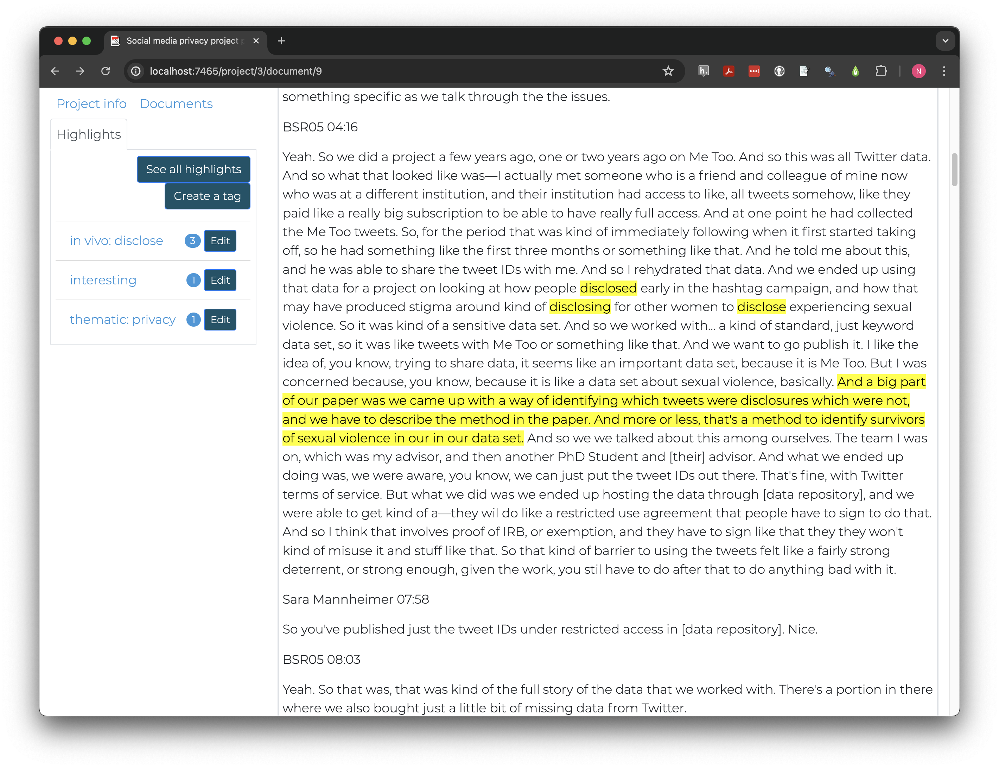

::: questions

- What is the difference between inductive and deductive coding?
- How can I set up and apply a flexible code tree in Taguette?
- How can I create and view highlights in Taguette?

:::

::: objectives

- Distinguish between inductive and deductive approaches to coding
- Develop deductive codes relevant to project objectives
- Create and view highlights in Taguette

:::

Beginning qualitative researchers often want to jump right into analyzing their data once documents are added to their project, but taking the time to develop a coding protocol first can save time while improving the transparency and quality of research.

The first step is typically to choose a coding philosophy, that is, to decide *how* and *why* code labels will be chosen and applied. Coding philosophies range along a spectrum from **inductive** to **deductive** approaches.

## Deductive and Inductive Reasoning

Deductive reasoning begins from assumptions and hypotheses. It seeks to determine, using logic or data, whether the hypotheses can be shown to be false (or true).

Experimental methods in many disciples follow this pattern. First, a hypothesis or prediction about the effect of some CAUSE is developed based on past research and observation. An experiment is conducted to isolate that CAUSE from other potential causes, and conclusions are drawn based on the presence (or lack) of difference made by the difference.

A medicine trial is a classic example of a deductive approach. Scientists predict that a medicine will help people in a specific way (for example, by reducing the length of an infection). They recruit participants (patients with the infection) who are randomly assigned so that some receive the medicine and others receive a placebo with no medicine. If the length of the infection is statistically shorter in the patients who received the medicine, that is taken as evidence that the medicine likely produced the desired result.

Deductive reasoning relies on minimizing exposure to outside variables that might affect the outcome of interest, or otherwise statistically adjusting for potential confounding factors.

Inductive reasoning, by contrast, seeks to draw more naturalistic conclusions by making close observations while recognizing personal biases and limits to observation. Inductive qualitative research draws on patterns observed in data to make predictions, generalizations, or analogies about more general patterns. Put differently, deductive research is explanatory in nature, while inductive research is exploratory.

Inductive social research often draws on critical or constructivist perspectives that emphasize how individuals and groups describe their own experience.

Taken in a longer scope, science can only develop through the complementary use of induction and deduction, sometimes visualized as a circular cycle. Observation is used to develop hypotheses, which are tested deductively through more observation. If hypotheses are not fully confirmed, inductive reasoning is used to develop revised or alternative hypotheses.

[FIGURE OF SCIENTIFIC PROCESS]

Even though deductive and inductive reasoning are both part of nearly every study in some way, how qualitative data is coded depends on the general purpose of the study. Exploratory studies tend to adopt an inductive method, while explanatory studies use more deductive approaches to code development.

## Inductive coding

In 1967, US sociologists Glaser and Strauss formalized (*grounded theory*)[https://en.wikipedia.org/wiki/Grounded_theory], one method for conducting structured qualitative research without presupposing a hypothesis or theory. They recognized that how people experience the world (i.e., the economy) can be at least as important as traditional measures (i.e., personal income or gross domestic product).

In grounded theory and other inductive coding methods, qualitative data like interview transcripts are read carefully and initial codes are applied that match the language and interpretation proposed by study participants themselves as closely as possible.

Often, researchers label codes in this *open coding* phase by using their judgment and experience to discern underlying themes in the experiences expressed across interviews. 

In our scenario, the goal of this analysis is to prepare for collecting and analyzing new data related to social media privacy and confidentiality. `BSR_05` is with a PhD student studying political communication.

We can open `BSR_05` in Taguette from the `Documents` tab. The text of the interview should appear on the right. In the body of the interview, speaker names and the time they started speaking in the recording appear on one line, followed by what they said. `Sara Mannheimer` is the interviewer and `BSR05` replaces the name of the student for privacy protection.

{alt="Image of Taguette with document BSR_05 open to timestamp 03:49"}

Scrolling 3 minutes and 49 seconds into the interview, we learn this person was using a large dataset of Twitter posts from the #MeToo movement with some significant privacy risks, for example:

> And a big part of our paper was we came up with a way of identifying which tweets were disclosures which were not, and we have to describe the method in the paper. And more or less, that's a method to identify survivors of sexual violence in our in our data set.

### Open coding

Tags (labelled codes) are applied to highlights (text excerpts). Select the two sentences above in Taguette and click "new highlight" then check "interesting" and "Save and Close." The text should now be highlighted in yellow.

::: instructor

### Exercise notes

The next challenge is flexible and can be done as a class or as a think-pair-share, where individuals spend 1-2 minutes brainstorming alone, then share with a partner and discuss, then with the class.

:::

::: challenge

### Creating open codes

Discuss as a class what kinds of labels you, as a social media privacy researcher, might apply to part or all of the excerpt above.

::: hint

Open codes can range from very specific to more general, but theoretically fruitful codes are often somewhere in the middle - general enough to apply in multiple situations but specific enough those excerpts have something more in common.

:::

::: solution

There are multiple words or phrases that might capture some of this excerpt's relevance for our research. Taguette allows applying multiple tags to one highlight. Doing so makes it easier to consider overlapping concepts, like "privacy" and "identity protection," as well as other aspects of the context, such as "sexual violence" or "crime victimization". 

:::

:::

::: callout

### How much to highlight?

Taguette supports multiple tags per highlight but does not allow overlapping highlights, making decisions about how large of excerpts to use more important. Highlights generally should be only long enough to provide context and understand meaning. Some researchers always code full sentences or even paragraphs, while others make decisions case by case.

:::

Let's create some of the tags we defined in our discussion. Click on the highlight and create additional tags. Names should be short and clear. Adding descriptions can help clarify the difference between similar tags, especially if working collaboratively with others.

{alt="Image of Taguette New Tag dialog for tag named privacy with description sharing or protection of personal information, including both web (social media, etc) and research}

The "Highlights" tab at the left allows us to see all the tags we've created and to how many highlights each has been applied. I created tags for both "privacy" and "identity protection" but later realized they overlap so much conceptually they don't need to be separated.

To merge two tags click "Edit" next to the tag you want to remove and click "Merge." Select the other tag in the "into" box, then "Merge tags." After merging, any highlights tagged with one or both original tag will have the name of the "into" tag and the other will be removed.

::: callout

### Plan twice; click once

> "Measure twice and cut once." -[English proverb](https://en.wiktionary.org/wiki/measure_twice_and_cut_once) meaning one should plan and prepare in a careful, thorough manner before taking action and act once precisely and properly.

Taguette has no undo or history functions. Merged or deleted tags cannot be retrieved. Even if you export a copy of a project before making changes, there is no import functionality to restore the project to its previous state within Taguette.

:::

### In vivo coding

An alternative approach to inductive coding, *in vivo coding*, tries to further reduce researcher bias effects by creating initial code labels only from the language used in the interviews themselves.

Let's look at a passage slightly earlier in the paragraph we've been working with.

> And we ended up using that data for a project on looking at how people disclosed early in the hashtag campaign, and how that may have produced stigma around kind of disclosing for other women to disclose experiencing sexual violence. So it was kind of a sensitive data set.

The person being interviewed used a number of words and phrases that may be relevant to data privacy protection in these sentences including disclosed, stigma, disclosing, disclose, experience, sexual violence, and sensitive data. Rather than categorizing themes at this stage, in vivo coding retains language used by the participants.

Let's highlight "disclosed" and apply a new tag called "disclose" to it. The same tag can be applied to "disclosing" and "disclose;" although they are different words, they have the same root word and express the same idea.

{alt="Image of Taguette document view with the words disclosed, disclosing, and disclose highlighted with the tag "disclose"}

::: challenge

### Coding trees

*Our project now combines thematic and in vivo coding in one document with no easy way to separate the types. Coding trees can help clarify and sort code groups.

Like the plants, code trees have branches, which may be types of codes or broad themes. Leaves, or specific codes or subcategories, each "grow" from one larger branch.*

Edit each tag you have created (e.g., not "interesting") and add either `in vivo: ` or `open: ` to create a code tree where codes are sorted by coding method.

::: solution

After editing tags, your project should look something like this:

{alt="Image of Taguette showing highlights tab with tags including 'in vivo: disclose' and 'open: privacy'"}

Some other qualitative software also implements dynamic code trees that allow multiple levels of nesting and automate viewing all subcodes (leaves) of a single code (branch), but embedding branches in code names is the only option currently available in Taguette.

:::

:::

Once applied, in vivo codes can be analyzed individually or later aggregated during the axial coding process, introduced in a later section.

## Deductive coding

Deductive codes are applied much the same way as open codes, but development takes place earlier, ideally before data collection, because tags and themes reflect theories and hypotheses the study is designed to test.

FIND A THEORETICAL FRAMEWORK IN MANNHEIMER FROM BEFORE MANNHEIMER AND APPLY

Like inductive and deductive reasoning, the separation between inductive and deductive coding is rarely complete. As a researcher, how closely you adhere to a single reasoning or coding model will likely depend on personal research questions and values, as well as norms in the fields where the research will be shared.

## Axial coding

Most qualitative projects require more than one round of coding for a few reasons:

1. The first documents rarely highlight every relevant theme. Themes and language important in later interviews may still be reflected in early interviews but less obvious before the theme was brought to the researcher's attention. Revisiting early interviews supports consistent code application.
2. Multiple coders may use tags in slightly different ways, which eventually need to be adjusted to a consistent scheme.
3. Key relationships between codes may only become obvious once initial codes are considered, leading to consolidation or the development of new tags as researchers become more familiar with the documents and themes.
4. When coding in vivo, people may use language differently and multiple phrases may represent a single idea.

MORE

::: keypoints

- Qualitative code protocols are developed based on research goals and philosophies
- Inductive research focuses on discovering or exploring themes and often uses open or in vivo coding
- Deductive research focuses on testing hypotheses and typically applies a predefined coding scheme based on theory
- In Taguette, tags are labelled codes applied to highlighted excerpts of text

:::
