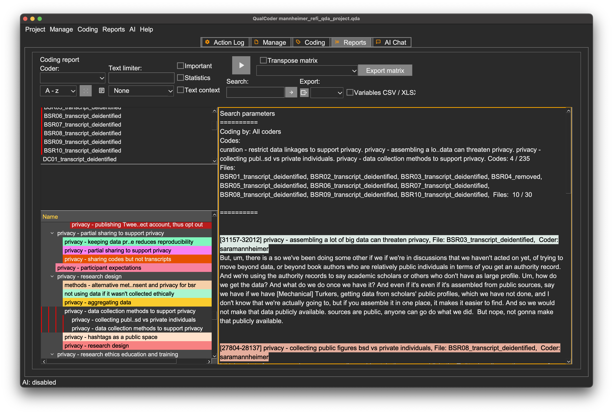

::: questions
-   How can QualCoder help analyze coded data?
-   What are some common approaches to analyzing qualitative data?
:::

::: objectives
-   Practice drawing conclusions about cases and themes with QualCoder
-   Distinguish questions answerable using cases, themes, or only in
    combination
:::

By the end of coding, researchers can be quite familiar with the data. Even if they have already drawn some tentative conclusions, structured data analysis is important to validate findings, discover alternatives, and document evidence and rationales. This step increases the research's impact and value not just for others, but for future revision or expansion of your own research.

How you can analyze your data depends on multiple decisions, including your software, the type of data you have, and how you structured your codes. But the choice of methods also depend on your research questions.

## Cases

In qualitative analysis, cases most often represent individual people, like those interviewed in the BSR interviews.

You may have already done some informal case-based analysis by observing the types of privacy concerns different researchers encountered or how they went about dealing with them.

Case analysis considers the similarities and differences between individuals to help understand people holistically, including their unique contexts. In its most basic form, reading an interview is a form of case analysis. Often, researchers keep notes about individual cases, which may include summaries of relevant information and thoughts about how different themes and personal characteristics seem related in that
individual's view of the world.

::: callout
### Groups

A case is not always a person. It can also be a document, an organization, a news source, or another unit of aggregation whose members are categorically distinct from one another. This primarily occurs in content analysis, rather than interview and focus group research.

Brittany Shaughnessy, for example, wrote a [thesis](https://hdl.handle.net/10919/103776), studying gun rights messaging in the 2020 US election. She performed qualitative content analysis on Twitter posts from the official accounts of two advocacy organizations: Everytown for Gun Safety (supports gun control) and the National Rifle Association (supports gun rights).

In this situation, individual media relations personnel are not the primary interest, even if we could identify them. The purpose of the research is to compare the topics and language used by advocacy organizations with contrasting goals.
:::

::: challenge
### Case analysis practice

The cases we have examined discuss privacy for a variety of social and review platforms, including (interview and starting timestamp in parentheses):

-   Academic peer review (BSR_01 `25:03`)
-   Wikipedia (BSR_02 `35:25`)
-   Twitter (BSR_03 `33:40`)

**Discuss some differences between the platforms in what concerns researchers express about data privacy and the challenges of resolving them. Are there common themes that emerge across all three?**

Treat this exercise as inductive and try to consider what you read as a whole, rather than focusing on the deductive themes we coded.
:::

Case analysis may be the primary focus of a study, particularly when the goal is to understand individual thought processes or group cultures.

## Themes

Themes inevitably emerge when studying cases, but in case-based analysis are treated primarily as features of specific contexts.

Thematic analysis, by contrast, focuses on how themes are similar or different across cases. Goals can include constructing general models of a concept, discovering how circumstances can impact an individual's mental model of a concept, and testing the validity of theoretical propositions in lived experience.

Each labeled code can be treated as a potential theme, and `Coding report` provides a direct way to view all passages coded to a specific tag. To see more context around the coded passage, right-click the highlighted header above that passage in the coding report, then choose `View in context`. This displays a pop-up window centered on the
passage that allows you to scroll through the rest of the file.

You may want to take notes on sub-themes or variations within a theme in a `journal`, a special type of memo in QualCoder meant to record your thoughts when coding. Create or edit journals from the `Manage - Journals` dialog.

Alternately, you can apply additional codes as you work more closely with individual themes, although codes can only be applied after returning to the `Code text` view.

::: callout
# QualCoder navigation tabs

QualCoder features five primary navigation tabs, visible at the top of the window: `Action Log`, `Manage`, `Coding`, `Reports`, and `AI Chat`. Switching to another tab and then switching back will not change what is displayed in the original tab. This allows you to move freely between managing files and journals, creating and applying codes, and viewing reports without having to worry about re-creating your work.

Be aware that opening another dialog within the same tab or menu (such as opening the `Code organizer` when `Code text` was previously displayed) *can*, however, replace the current display.
:::

QualCoder also provides a count of the number of passages to which each code has been applied, which can give a quick sense of how ubiquitous themes are across your data. Be cautious about using such counts to draw conclusions, however. A theme may be mentioned only a small number of times but still be critical to understanding a topic or how subgroups of individuals think about that theme.

The `Code frequencies` report also allows counting the number of times themes appear in a specific subset of files.

Code frequencies may provide an impression of how widely relevant specific themes are. But again, counts cannot reveal the richness of the stories qualitative research is designed to engage, so exercise judgment before using them as a primary analytic tool.

:::: challenge
### Thematic analysis think-pair-share

1.  Spend 3 minutes reviewing the coding report for the code `privacy - considering potential harms` (not the whole category).
2.  Discuss with a partner for 2 minutes what kinds of potential harms the passages reveal and whether they seem to fall into subtypes.
3.  Discuss your group's findings with the group for 3-5 minutes, with a goal of identifying any subthemes or subtypes that might merit more investigation.

::: hint
Select all files (click on one file in the box then press `CMD/CTRL+a` to select all). Select only the **code** `privacy - considering potential harms`, although it is within a **category** of the same name.
:::
::::

## Framework matrices

Framework matrices are a type of visual organizer some qualitative researchers use to conduct and interpret analysis. A framework matrix places one case or group in each row and one theme in each column, with the themes related to a single overarching framework. Once the table is set up (on a computer or by hand), the researcher fills each cell with one or more quotes or summaries that encapsulate that theme for the case
or group.

This process is undertaken systematically, following these steps outlined by [Laurie J.
Goldsmith](/files/goldsmith-2021-framework-analysis.pdf):

1.  Data familiarization
2.  Identifying a thematic framework
3.  Indexing all study data against the framework
4.  Charting to summarize the indexed data
5.  Mapping and interpretation of patterns found within the chart

The table below is an abbreviated example of what a completed framework matrix might look like, using modified versions of some of Sarah Mannheimer's `privacy` codes as an example:

+-----------------+----------------+----------------+----------------+
|                 | data           | data security  | data sharing   |
|                 | collection     |                |                |
+:================+================+================+================+
| BSR_03          | "if you        |                |                |
|                 | assemble it in |                |                |
|                 | one place, it  |                |                |
|                 | makes it       |                |                |
|                 | easier to      |                |                |
|                 | find. And so   |                |                |
|                 | we would not   |                |                |
|                 | make that data |                |                |
|                 | publicly       |                |                |
|                 | available.     |                |                |
|                 | sources are    |                |                |
|                 | public, anyone |                |                |
|                 | can go do what |                |                |
|                 | we did. But    |                |                |
|                 | nope, not      |                |                |
|                 | gonna make     |                |                |
|                 | that publicly  |                |                |
|                 | available."    |                |                |
|                 |                |                |                |
|                 | "one of my     |                |                |
|                 | students is    |                |                |
|                 | working on     |                |                |
|                 | review based   |                |                |
|                 | recommendation |                |                |
|                 | and making use |                |                |
|                 | of that review |                |                |
|                 | text. And      |                |                |
|                 | they're, like, |                |                |
|                 | since it's     |                |                |
|                 | review text,   |                |                |
|                 | if I really    |                |                |
|                 | wanted to      |                |                |
|                 | figure out who |                |                |
|                 | a user is I    |                |                |
|                 | and I could go |                |                |
|                 | figure out who |                |                |
|                 | wrote that     |                |                |
|                 | review,        |                |                |
|                 | because it's   |                |                |
|                 | on, it's like, |                |                |
|                 | they just      |                |                |
|                 | scraped        |                |                |
|                 | Goodreads      |                |                |
|                 | public         |                |                |
|                 | reviews. Yeah, |                |                |
|                 | but I'm not    |                |                |
|                 | going to go do |                |                |
|                 | that. Because  |                |                |
|                 | re-identifying |                |                |
|                 | users is not   |                |                |
|                 | the business   |                |                |
|                 | for it."       |                |                |
+-----------------+----------------+----------------+----------------+
| BSR_05          |                | "I was always  | "we generally  |
|                 |                | trying to      | try not to     |
|                 |                | wonder like,   | quote people   |
|                 |                | how many       | who aren't     |
|                 |                | copies of this | like public,   |
|                 |                | data should I  | big public     |
|                 |                | have?And like, | figures or     |
|                 |                | where should   | who, like,     |
|                 |                | these be. But  | wouldn't       |
|                 |                | because the    | expect that    |
|                 |                | more copies    | their tweet    |
|                 |                | there are      | could be       |
|                 |                | like, the more | quoted... So   |
|                 |                | chances there  | what we ended  |
|                 |                | are that       | up doing for   |
|                 |                | someone is     | those was      |
|                 |                | gonna be able  | altering, we   |
|                 |                | to touch it    | didn't report  |
|                 |                | that shouldn't | actually       |
|                 |                | be able to     | direct quotes, |
|                 |                | touch it."     | we altered the |
|                 |                |                | text. And we   |
|                 |                |                | do like        |
|                 |                |                | altered texts, |
|                 |                |                | and we         |
|                 |                |                | mismatch—mash  |
|                 |                |                | together, like |
|                 |                |                | similar        |
|                 |                |                | tweets, so     |
|                 |                |                | that,          |
|                 |                |                | hopefully,     |
|                 |                |                | they shouldn't |
|                 |                |                | be             |
|                 |                |                | identifiable.  |
|                 |                |                | Like, you      |
|                 |                |                | shouldn't be   |
|                 |                |                | able to        |
|                 |                |                | reverse look   |
|                 |                |                | them up or     |
|                 |                |                | something like |
|                 |                |                | that"          |
|                 |                |                |                |
|                 |                |                | "what pushed   |
|                 |                |                | that           |
|                 |                |                | conversation   |
|                 |                |                | into releasing |
|                 |                |                | them was that  |
|                 |                |                | I was able to  |
|                 |                |                | propose [the   |
|                 |                |                | data           |
|                 |                |                | repository we  |
|                 |                |                | used] as kind  |
|                 |                |                | of this—I      |
|                 |                |                | think someone  |
|                 |                |                | referred to it |
|                 |                |                | like as a      |
|                 |                |                | walled garden  |
|                 |                |                | approach, like |
|                 |                |                | the data is    |
|                 |                |                | there, you can |
|                 |                |                | see it, but    |
|                 |                |                | like, there's  |
|                 |                |                | a wall around  |
|                 |                |                | it, that only  |
|                 |                |                | certain people |
|                 |                |                | can get        |
|                 |                |                | through"       |
+-----------------+----------------+----------------+----------------+
| BSR_07          |                | "the approach  |                |
|                 |                | that I've been |                |
|                 |                | told is        |                |
|                 |                | sufficient or  |                |
|                 |                | is a good      |                |
|                 |                | approach is    |                |
|                 |                | basically that |                |
|                 |                | you are        |                |
|                 |                | storing the    |                |
|                 |                | data on a      |                |
|                 |                | password       |                |
|                 |                | protected      |                |
|                 |                | computer. I    |                |
|                 |                | backed things  |                |
|                 |                | up to a        |                |
|                 |                | external hard  |                |
|                 |                | drive, and     |                |
|                 |                | that's also    |                |
|                 |                | password       |                |
|                 |                | protected. And |                |
|                 |                | I know I       |                |
|                 |                | don't, oh, and |                |
|                 |                | also, I shared |                |
|                 |                | some data with |                |
|                 |                | my co-author   |                |
|                 |                | on Google      |                |
|                 |                | Drive. And,    |                |
|                 |                | and it was,    |                |
|                 |                | you know,      |                |
|                 |                | again, it was  |                |
|                 |                | it was shared  |                |
|                 |                | only with him. |                |
|                 |                | So I feel, I   |                |
|                 |                | feel like      |                |
|                 |                | those are      |                |
|                 |                | sufficient     |                |
|                 |                | steps to, to   |                |
|                 |                | safeguard      |                |
|                 |                | c              |                |
|                 |                | onfidentiality |                |
|                 |                | and privacy."  |                |
+-----------------+----------------+----------------+----------------+
| BSR_08          | "we usually    |                |                |
|                 | would not, in  |                |                |
|                 | the paper      |                |                |
|                 | publish, the   |                |                |
|                 | Twitter        |                |                |
|                 | handles, or    |                |                |
|                 | the names of   |                |                |
|                 | individuals,   |                |                |
|                 | except for     |                |                |
|                 | organizations" |                |                |
+-----------------+----------------+----------------+----------------+
| BSR_10          | "we collected  |                |                |
|                 | a tweet posted |                |                |
|                 | by the         |                |                |
|                 | libraries in   |                |                |
|                 | [disaster      |                |                |
|                 | areas] and     |                |                |
|                 | then wanted to |                |                |
|                 | look at how    |                |                |
|                 | they           |                |                |
|                 | communicated   |                |                |
|                 | during a       |                |                |
|                 | certain like   |                |                |
|                 | [disasters].   |                |                |
|                 | And there were |                |                |
|                 | some just      |                |                |
|                 | library        |                |                |
|                 | patrons        |                |                |
|                 | communicating  |                |                |
|                 | with these     |                |                |
|                 | libraries. So  |                |                |
|                 | in the case,   |                |                |
|                 | when I publish |                |                |
|                 | things, I try  |                |                |
|                 | not to focus   |                |                |
|                 | on these       |                |                |
|                 | individuals."  |                |                |
+-----------------+----------------+----------------+----------------+

: Table 1: Framework matrix of data privacy-related concerns in Big
Social Research

In the matrix above, `Coding report` was used to find sections of BSR
interviews related to each of the three topics. For example, all codes
in these three categories were used as sources for the first column
(based on the report shown below:

-   privacy - assembling a lot of data can threaten privacy
-   privacy - try to collect as little data as possible
-   privacy - research design - privacy - data collection methods to support privacy

Much of the work of analysis and theory-building is part of creating a framework matrix, and so, by the time you finish, you'll likely already be much closer to answering research questions. That said, there are also advantages to working with a framework matrix during the analytic process, as well as their utility as a summary tool for others.

Reading across columns (within a line) on a framework matrix allows for analyzing cases. Reading down rows (within a column) allows for thematic analysis. And having both summarized together opens up options to study how clusters of cases may share similar approaches to themes. This kind of intersectional analysis can be done informally, or can be used to create formal case classifications or thematic typologies to stimulate further theory-building and research.

::: callout
### Sentiment and degree

Sometimes, particularly when considering deductive hypotheses, it is not enough to code only for the presence or absence of a theme. In such situations, semi-quantitative coding may be applied in one of at least two ways.

Sentiment codes indicate whether the feeling or attitude expressed in an excerpt of text is positive, neutral, negative, or mixed in relation to a theme. Neutral and mixed can be hard to distinguish. Neutral sentiment is generally unbothered about good or bad in relation to something, while a mixed sentiment includes both positive and negative feelings, often toward different aspects or implications.

In the excerpt below from `BSR_02`, certain Wikipedia contributors are attributed a negative sentiment toward contribution disclosures, which might also be framed as a positive sentiment toward privacy.

> Some of them like hold ideological views that are against like the
> counting of contributions. And they're just like, "I don't believe
> that that's something we should be doing. And so I want to remove
> myself from this list."

Sentiment codes can be applied in the same way as other codes, by creating a category like `sentiment` then adding codes like `positive`. They work best when applied to the same excerpts as a thematic code, so there is no ambiguity as to which theme is associated with the sentiment.

An alternative way to integrate degrees of valuation into qualitative coding is to code on a scale. For example, the amount of stake that a sexual assault survivor has in protecting their identity from disclosure is higher than that of a Wikipedia contributor who wishes to remain anonymous to avoid attention. Scales typically are numeric with a relatively small number of rating points, such as a three-point `Low`, `Medium`, `High` scale.

Occasionally, qualitative data also asks about specific quantitative measures that may have more natural units, such as a study of childhood reading experiences that asks about how many minutes a day each parent reads to their child.

QualCoder provides no option to directly attach a numeric rating to a tag. It is again possible to create a separate set of codes to capture ratings, as described above for sentiment, but not in the same way as some other CAQDAS packages which provide integrated code scoring functionality.
:::

::: keypoints
-   Case analysis focuses on the unique situation of each person or
    group
-   Theme analysis focuses on how the study population perceives or
    discusses themes or ideas
-   Framework matrices are a formal method to combine case and theme
    analysis using a visual organizer
-   Information on sentiment, degree, or quantity can also be encoded
    for qualitative analysis
:::
