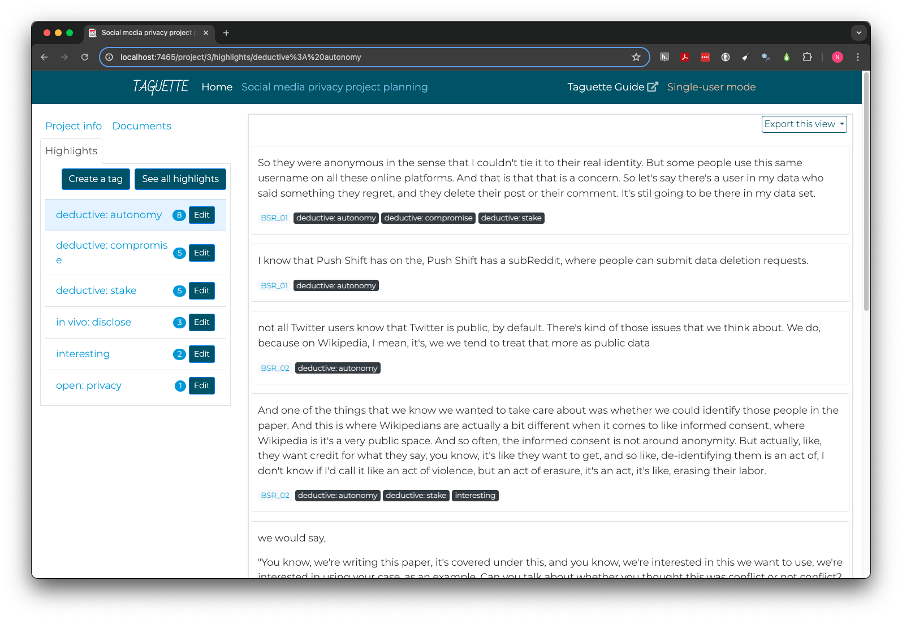

::: questions
-   How can Taguette help analyze coded data?
-   What are some common approaches to analyzing qualitative data?
:::

::: objectives
-   Practice drawing conclusions about cases and themes with Taguette
-   Distinguish questions answerable using cases, themes, or only in
    combination
:::

By the end of coding, researchers can be quite familiar with the data.
Even if they have already drawn some tentative conclusions, structured
data analysis is important to validate findings, discover alternatives,
and document evidence and rationales. This step increases the research's
impact and value not just for others, but for future revision or
expansion of your own research.

How you can analyze your data depends on multiple decisions, including
your software, the type of data you have, and how you structured your
codes. But the choice of methods also depend on your research questions.

## Cases

In qualitative analysis, cases most often represent individual people,
like those interviewed in the BSR interviews.

You may have already done some informal case-based analysis by observing
the types of privacy concerns different researchers encountered or how
they went about dealing with them.

Case analysis considers the similarities and differences between
individuals to help understand people holistically, including their
unique contexts. In its most basic form, reading an interview is a form
of case analysis. Often, researchers keep notes about individual cases,
which may include summaries of relevant information and thoughts about
how different themes and personal characteristics seem related in that
individual's view of the world.

::: callout

### Groups

A case is not always a person. It can also be a document, an
organization, a news source, or another unit of aggregation whose
members are categorically distinct from one another. This primarily
occurs in content analysis, rather than interview and focus group
research.

Brittany Shaughnessy, for example, wrote a
[thesis](https://hdl.handle.net/10919/103776), studying gun rights
messaging in the 2020 US election. She performed qualitative content
analysis on Twitter posts from the official accounts of two advocacy
organizations: Everytown for Gun Safety (pro gun control) and the
National Rifle Association (pro gun rights).

In this situation, individual media relations personnel are not the
primary interest, even if we could identify them. The purpose of the
research is to compare the topics and language used by advocacy
organizations with contrasting goals.
:::

::: spoiler
### Importing a project

If you did not code sections of all three interviews (BSR_01, BSR_02,
BSR_05) to the three deductive codes in the previous section, you may
want to download the [sample project](files/sample-project.sqlite3) by
navigating to `Home` (top bar) in Taguette and choosing
`Import a project file`. Click `Choose File` and select the file you
downloaded then click `Import project`. The sample project is fully
coded and will allow you to complete the exercises in this section.
:::

::: challenge
### Case analysis practice

The cases we have examined discuss privacy for a variety of social and
review platforms, including (interview and starting timestamp in
parentheses):

-   Academic peer review (BSR_01 `25:03`)
-   Wikipedia (BSR_02 `35:25`)
-   Twitter (BSR_03 `33:40`)

**Discuss some differences between the platforms in what concerns
researchers express about data privacy and the challenges of resolving
them. Are there common themes that emerge across all three?**

Treat this exercise as inductive and try to consider what you read as a
whole, rather than focusing on the deductive themes we coded.

::: hint
### Backlight

Click the `Backlight` box below the `Documents` list in Taguette to grey
out all non-highlighted text. This can help to easily find sections
coded as relevant for analysis.
:::
:::

Case analysis may be the primary focus of a study, particularly when the
goal is to understand individual thought processes or group cultures.

## Themes

Themes inevitably emerge when studying cases, but are ultimately
considered as part of specific contexts. Thematic analysis, by contrast,
focuses on how themes are similar or different across cases. Goals can
include constructing general models of a concept, discovering how
circumstances can impact an individual's mental model of a concept, and
testing the validity of theoretical propositions in lived experience.

Each labeled code can be treated as a potential theme, and Taguette
provides a direct way to view all highlights coded to a specific tag.

First, click the `Highlights` tab in the top left. Then, click the name
of the desired tag. Instead of an interview, the right pane will now
display the text of each highlight coded to that tag, as well as its
document, and a list of all tags applied to the same highlight.

{alt="Image of Taguette showing highlights for the deductive tag named autonomy"}

There are many ways to perform theme analysis. The tags below each
highlight are interactive and allow you to quickly navigate to that
document or theme by clicking, making it easier to iteratively explore
the context of highlights or relationships between themes.

You may want to take notes on sub-themes or variations within a theme in
a separate document. Alternately, you can add new highlights as you work
more closely with individual themes, although highlights and tags can
only be added after returning to document view.

Taguette also provides a count of the number of highlights to which each
tag has been applied, which can give a quick sense of how ubiquitous
themes are across your data. Be cautious about using such counts to draw
conclusions, however. A theme may be mentioned only a small number of
times but still be critical to understanding a topic or how subgroups of
individuals think about that theme.

Some software also allows counting the number of times themes appear in
each document or case. This, too, can provide a basic read on how widely
relevant specific themes are. But again, counts cannot reveal the
richness of the stories qualitative research is designed to engage, so
exercise judgment before using them as a primary analytic tool.

::: challenge
### Thematic analysis think-pair-share

1.  Spend 2 minutes reviewing the highlights for `deductive: stake.`
2.  Discuss with a partner for 2 minutes what kinds of reasons the
    highlights suggest for social media users may have personal interest
    in how their data is shared and identified.
3.  Discuss your group's findings with the class for 3-5 minutes,
    including what kinds of stake might have been missed in considering
    only a single case.
:::

## Framework matrices

Framework matrices are a type of visual organizer some qualitative
researchers use to conduct and interpret analysis. A framework matrix
places one case or group in each row and one theme in each column, with
the themes related to a single overarching framework. Once the table is
set up (on a computer or by hand), the researcher fills each cell with
one or more quotes or summaries that encapsulate that theme for the case
or group.

This process is undertaken systematically, following these steps
outlined by [Laurie J.
Goldsmith](/files/goldsmith-2021-framework-analysis.pdf):

1.  Data familiarization
2.  Identifying a thematic framework
3.  Indexing all study data against the framework
4.  Charting to summarize the indexed data
5.  Mapping and interpretation of patterns found within the chart

The table below is an abbreviated example of what a completed framework
matrix might look like, using the coding undertaken in the last episode:

|        | autonomy                                                                                                                                                                        | compromise                                                                                                                          | stake                                                                                                                                   |
|:------------------|------------------|------------------|------------------|
| BSR_01 | Anonymous data linked to usernames might still be connected to other platforms                                                                                                  | Releasing data with public usernames is allowed and anonymous but could be reidentified                                             | Misrepresentation in data sharing can hurt or offend subjects, even when the misrepresentation is faithful to the research topic        |
| BSR_02 | Expectations and knowledge of control differ by platform, and users vary in their reasons and desires to share or hide their interactions                                       | Removing identifiers from shared data and paper but not raw analysis protects privacy but prevents reproducibility and transparency | there is sometimes a personal stake in having data shared or credited rather than having it kept private                                |
| BSR_05 | The scale of big social data can mean reidentification would be easier with existing public data than datasets, as long as direct discovery pathways like Tweet ids are omitted | NA | Data related to sensitive disclosures, even if they were made publicly, may need to be protected for compelling interest such as safety |

Much of the work of analysis and theory-building is part of creating a framework matrix, and so, by the time you finish, you'll likely already be much closer to answering research questions. That said, there are also advantages to working with a framework matrix during the analytic process, as well as their utility as a summary tool for others.

Reading across columns, within a line, on a framework matrix allows for analyzing cases. Reading down rows, within a column, allow for thematic analysis. And having both summarized together opens up options to study how clusters of cases may share similar approaches to themes. This kind of intersectional analysis can be done informally, or can be used to create formal case classifications or thematic typologies to stimulate further theory-building and research.

::: callout

### Sentiment and degree

Sometimes, particularly when considering deductive hypotheses, it is not enough to code only for the presence or absence of a theme. In such situations, semi-quantitative coding may be applied in one of at least two ways.

Sentiment codes indicate whether the feeling or attitude expressed in an excerpt of text is positive, neutral, negative, or mixed in relation to a theme. Neutral and mixed can be hard to distinguish. Neutral sentiment is generally unbothered about good or bad in relation to something, while a mixed sentiment includes both positive and negative feelings, often toward different aspects or implications.

In the excerpt below from `BSR_02`, certain Wikipedia contributors are attributed a negative sentiment toward contribution disclosures, which might also be framed as a positive sentiment toward privacy.

> Some of them like hold ideological views that are against like the counting of contributions. And they're just like, "I don't believe that that's something we should be doing. And so I want to remove myself from this list."

Sentiment codes can be applied in the same way as other codes, for example with a tag for `sentiment: positive.` They work best when applied to the same highlight as a single thematic code, so there is no ambiguity as to which theme is associated with the sentiment.

An alternative way to integrate degrees of valuation into qualitative coding is to code on a scale. For example, the amount of stake that a sexual assault survivor has in protecting their identity from disclosure is higher than that of a Wikipedia contributor who wishes to remain anonymous to avoid attention. Scales typically are numeric with a relatively small number of rating points, such as a three-point `Low`, `Medium`, `High` scale.

Occasionally, qualitative data also asks about specific quantitative measures that may have more natural units, such as a study of childhood reading experiences that asks about how many minutes a day each parent reads to their child.

Taguette provides no option to attach a numeric rating to a tag. It is again possible to create a separate set of codes to capture ratings, as described above for sentiment, but many full-featured paid CAQDAS packages provide native ratings functionality.

:::

::: keypoints

- Case analysis focuses on the unique situation of each person or group
- Theme analysis focuses on how the study population perceives or discusses themes or ideas
- Framework matrices are a formal method to combine case and theme analysis using a visual organizer
- Information on sentiment, degree, or quantity can also be encoded for qualitative analysis

:::
