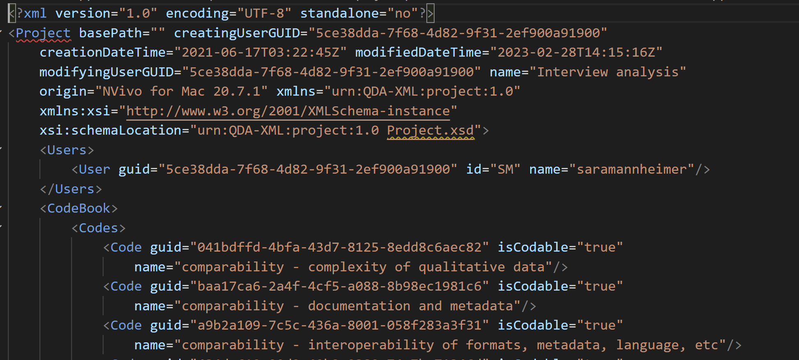
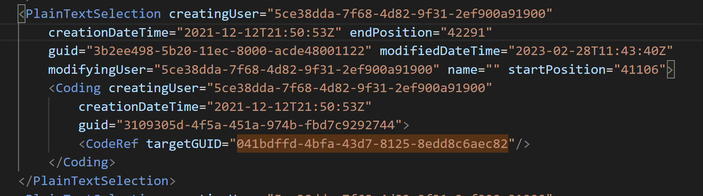

It may be helpful to understand the basics of the `QDPX`, or REFI-QDA Project, standard. Every REFI-QDA Project files ends in the `.qdpx` file extension. It is a compressed archive of files. You're likely familiar with a `ZIP` file, and that's exactly what this is -- in fact, if you change the file extension to `.zip` you can extract it and see all of its components. This archive contains one folder (`sources`) with all your source files. It also includes a single `XML` file, with a `.qde` extension, that includes information about how the files relate to each other -- the codes, annotations, memos, etc.

Let's look at the XML file for the data project discussed in this course briefly to get a better sense. The file starts with a preamble -- title, creator, original software -- followed by the codebook. You can see that each code has a name and a unique ID.
{alt="Image of the top section of the XML file of a REFI-QDA project, showing a section called 'Project' with the user (Sarah Mannheimer) and software (NVivo) defined, followed by a section called 'Codebook' with a number of codes"}

Further down, every code or annotation is defined based on its position in the respective file. In this example, you can see a text section (defined by start position and end position) of a coded excerpt. The code is defined by its unique ID (a universally unique ID, uuid) -- it is in fact the first code visible on the screenshot above, i.e. "comparability - complexity of qualitative data". 
{alt="Image of a section of the REFI-QDA XML that shows a single code. It defines the use assigning the code, the time, and its start and end point. Most properties are defined using long alphanumeric strings (uuids)"}